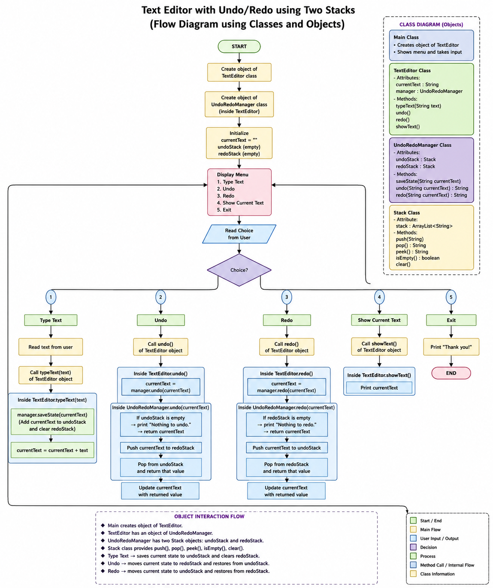

# Text Editor with Undo/Redo using Two Stacks

A simple console-based **Java Text Editor** that demonstrates **Undo** and **Redo** functionality using the **Two Stacks** data structure. The project is designed as a **Low-Level Design (LLD)** implementation showcasing **Object-Oriented Programming (OOP)** concepts such as classes, objects, encapsulation, and object composition.

---

## Overview

The application allows users to:

- Type text
- Undo the last change
- Redo an undone change
- Display the current text
- Exit the application

The editor uses two stacks to efficiently manage text states:

- **Undo Stack** – Stores previous text states.
- **Redo Stack** – Stores undone states for redo operations.

---

## Problem Statement

Develop a console-based text editor that supports **Undo** and **Redo** operations efficiently using **Two Stacks** while following Object-Oriented Programming principles.

---

## Objectives

- Implement a text editor in Java.
- Demonstrate the Stack data structure.
- Implement Undo and Redo functionality.
- Apply OOP concepts using classes and objects.
- Build a simple menu-driven console application.

---

## Features

- Type text
- Undo previous changes
- Redo undone changes
- Display current text
- Menu-driven interface
- Custom Stack implementation
- Single Java source file using multiple classes

---

## Technologies Used

- **Language:** Java
- **IDE:** Visual Studio Code
- **Version Control:** Git
- **Repository:** GitHub

---

## Data Structure Used

### Two Stacks

The application maintains two stacks:

### Undo Stack

Stores previous text states before every modification.

### Redo Stack

Stores states removed during an Undo operation, allowing them to be restored using Redo.

---

## Project Structure

```text
TextEditor-UndoRedo
│
├── README.md
├── .gitignore
│
├── docs
│   ├── FlowDiagram.png
│   └── README_Project.md
│
├── output
│   └── SampleOutput.txt
│
└── src
    └── Main.java
```

---

# Flow Diagram

<p align="center">
    
</p>

---

## Classes Used

Although the project uses a single source file (`Main.java`), it contains four classes:

### Main

- Displays the menu
- Reads user input
- Creates the `TextEditor` object
- Controls program execution

---

### TextEditor

Responsible for editor operations.

**Methods**

- `typeText()`
- `undo()`
- `redo()`
- `showText()`

---

### UndoRedoManager

Handles the Undo and Redo logic.

**Responsibilities**

- Save previous states
- Undo changes
- Redo changes

---

### Stack

Custom stack implementation using `ArrayList<String>`.

**Methods**

- `push()`
- `pop()`
- `peek()`
- `isEmpty()`
- `clear()`

---

## Algorithm

1. Start the application.
2. Create the `TextEditor` object.
3. Initialize:
   - Current text
   - Undo Stack
   - Redo Stack
4. Display the menu.
5. Read the user's choice.
6. If **Type Text**:
   - Save current state into Undo Stack.
   - Clear Redo Stack.
   - Append new text.
7. If **Undo**:
   - Move current state to Redo Stack.
   - Restore previous state from Undo Stack.
8. If **Redo**:
   - Move current state to Undo Stack.
   - Restore state from Redo Stack.
9. If **Show Current Text**:
   - Display current text.
10. Exit the application.

---

## Sample Output

```text
==============================
 TEXT EDITOR WITH UNDO/REDO
==============================

1. Type Text
2. Undo
3. Redo
4. Show Current Text
5. Exit

Enter your choice: 1
Enter text: hello

Enter your choice: 1
Enter text: world

Enter your choice: 4

Current Text: helloworld

Enter your choice: 2

Enter your choice: 4

Current Text: hello

Enter your choice: 3

Enter your choice: 4

Current Text: helloworld

Enter your choice: 5

Thank you!
```

---

## OOP Concepts Used

- Classes and Objects
- Encapsulation
- Abstraction
- Object Composition
- Modularity

---

## Future Enhancements

- GUI using Java Swing or JavaFX
- Save/Open text files
- Copy, Cut and Paste
- Search and Replace
- Keyboard shortcuts
- Rich text editor

---

## Learning Outcomes

- Understanding of Stack data structures.
- Practical implementation of Undo/Redo.
- Experience with Java Object-Oriented Programming.
- Git and GitHub version control.
- Low-Level Design (LLD) implementation using classes and objects.

---

## Author

**Tamilvel Mugunthan S**

Electrical and Electronics Engineering

---

## License

This project is developed for educational and academic purposes.
